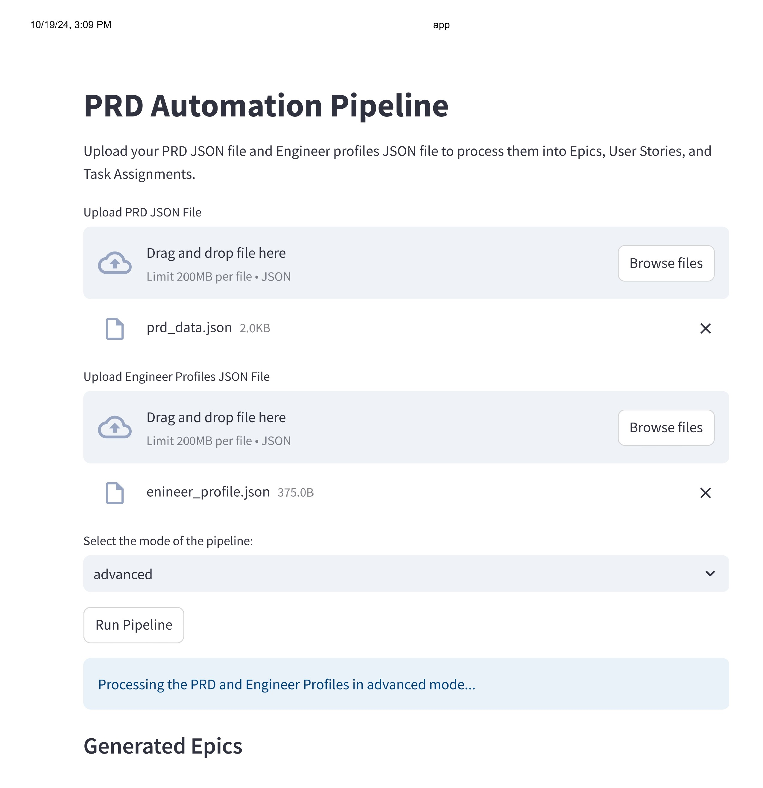
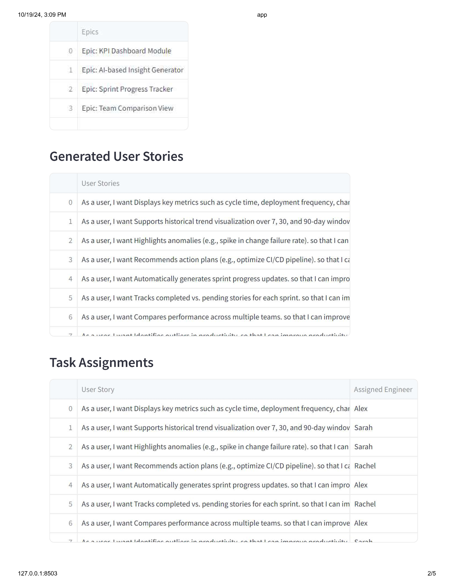
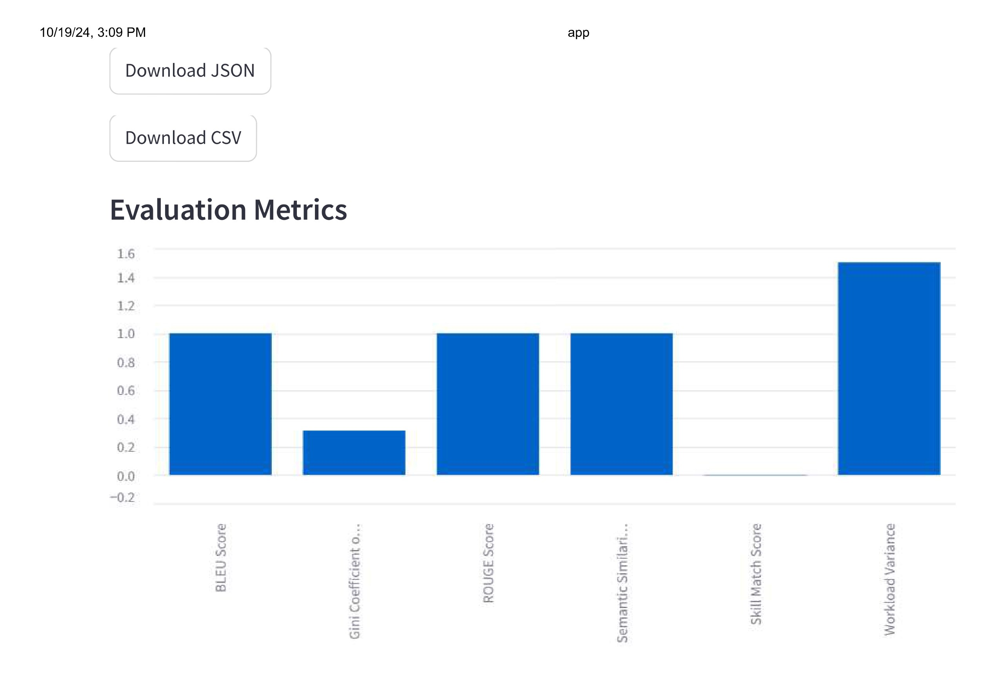
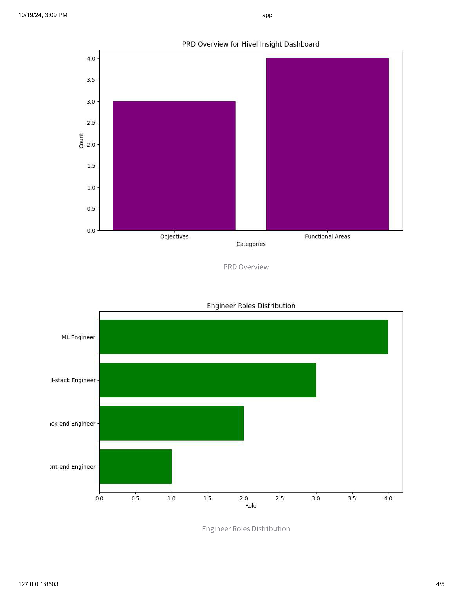

# PRD Automation Pipeline

A fully automated solution for analyzing and breaking down Product Requirement Documents (PRDs) using AI/ML and NLP, with intelligent task assignment and workload balancing. Includes streamlined deployment.

---

## 📖 **Table of Contents**

1. [Project Overview](#project-overview)
2. [Technologies](#technologies)
3. [Setup & Installation](#setup--installation)
4. [Running the Application](#running-the-application)
5. [Screenshots](#screenshots)
---


## 📝 **Project Overview**

The PRD Automation Pipeline is designed to automate the analysis and breakdown of Product Requirement Documents (PRDs). It extracts key sections from the PRD, generates epics and user stories, assigns tasks to engineers based on skills and workloads, and evaluates the pipeline's performance using various metrics.

The pipeline supports three modes:
1. **Basic Mode**
2. **Advanced Mode**
3. **Optimized Mode**

## How All Three Pipelines Work
The PRD Automation Pipeline consists of three modes:

### 1. **Basic Mode**
- **Techniques Used**:
  - Simple regex-based extraction of PRD sections.
  - Round-robin task assignment with basic workload balancing.
- **Task Assignment Logic**:
  - The pipeline extracts PRD sections (objectives, functional requirements, user personas).
  - Epics and user stories are generated from functional requirements.
  - Tasks are assigned to engineers in a round-robin manner while keeping workloads relatively balanced.
- **Evaluation**:
  - Evaluates workload variance, skill match score (basic matching), and other simple metrics.
- **Use Case**: 
  - Suitable for smaller teams and simpler PRDs where requirements are straightforward and uniform.

### 2. **Advanced Mode**
- **Techniques Used**:
  - Uses a transformer model (e.g., SentenceTransformer) to perform semantic extraction of PRD sections.
  - Assigns tasks based on semantic similarity between user stories and engineers’ skills.
- **Task Assignment Logic**:
  - Extracts PRD sections using transformer models to achieve better context understanding.
  - Calculates cosine similarity between task embeddings and skill embeddings to find the best-matching engineer.
  - Considers workload balancing by distributing tasks based on similarity scores adjusted for current workloads.
- **Evaluation**:
  - Uses advanced metrics like **Semantic Similarity Score**, **BLEU**, and **ROUGE Scores** to measure extraction quality.
  - Evaluates **Skill Match Score** more precisely using semantic embeddings.
- **Use Case**: 
  - Suitable for medium-sized teams with more complex PRDs that require better context understanding and skill-based task matching.

### 3. **Optimized Mode**
- **Techniques Used**:
  - Similar to the Advanced Mode but includes a knapsack optimization algorithm to maximize skill matching while keeping workloads balanced.
  - Uses reinforcement learning-like strategies to refine task assignments over time.
- **Task Assignment Logic**:
  - Performs task assignment based on skill matching, but with optimization that considers both workload and skill simultaneously.
  - Uses a Dynamic Programming-based Knapsack Algorithm to find the most optimal assignment that maximizes the skill match and minimizes workload variance.
- **Evaluation**:
  - Includes additional metrics such as **Gini Coefficient** to evaluate workload equality.
  - Measures **Skill Match Score**, **BLEU**, **ROUGE**, and **semantic similarity** more comprehensively.
- **Use Case**: 
  - Suitable for large teams with complex PRDs where tasks need to be optimally balanced across multiple engineers based on skills and workloads.

## Example of Evaluation Metrics
The pipeline uses a variety of metrics to evaluate task assignments and section extraction:

1. **Skill Match Score**: Measures the average cosine similarity between user stories and engineers' skills.
2. **Workload Variance**: Measures the variance in the number of tasks assigned to engineers.
3. **Gini Coefficient**: Evaluates how evenly tasks are distributed among engineers (lower is better).
4. **BLEU Score**: Evaluates how well the extracted sections match with expected PRD sections.
5. **ROUGE Score**: Measures recall of phrases in the extracted sections.
6. **Semantic Similarity Score**: Evaluates how semantically similar the extracted sections are to expected sections.


---

## 🛠️ **Technologies**

- **Python 3.10**
- **Natural Language Processing (NLP)**: `transformers`, `sentence-transformers`
- **Machine Learning**: `Reinforcement Learning`
- **Streamlit**: Web-based interactive app

---

## ⚙️ **Setup & Installation**

### 1. Clone the Repository
```bash
git clone https://github.com/yourusername/prd-automation-pipeline.git
cd prd-automation-pipeline
```

### 2. Install Dependencies
Make sure you have Python 3.10 installed. Install the required dependencies using `pip`:
```bash
pip install -r requirements.txt
```

---

## 🚀 **Running the Application**

You can run the application in different modes:

### 1. **Basic Mode**
This mode uses simple round-robin task assignment.
```bash
python3 pipeline.py --mode basic --prd_file data/prd_data.json --engineers data/engineer_profile.json
```

### 2. **Advanced Mode**
This mode assigns tasks based on engineers' skills.
```bash
python3 pipeline.py --mode advanced --prd_file data/prd_data.json --engineers data/engineer_profile.json
```

### 3. **Optimized Mode**
This mode uses reinforcement learning for skill-based task assignment and workload balancing.
```bash
python3 pipeline.py --mode optimized --prd_file data/prd_data.json --engineers data/engineer_profile.json
```

```bash
streamlit run app.py
```
---

## 💻 **Usage**

### Streamlit App
1. Upload your **PRD JSON** and **Engineer Profiles JSON**.
2. Select the mode (`basic`, `advanced`, or `optimized`).
3. View the generated epics, user stories, and task assignments.
4. Download results in **JSON** or **Excel** format.

### Example PRD JSON Input:
```json
{
    "product_name": "Hivel Insight Dashboard",
    "objectives": [
        "Provide real-time visibility into software engineering KPIs.",
        "Identify productivity bottlenecks."
    ],
    "functional_requirements": {
        "KPI Dashboard Module": [
            "Displays key metrics such as cycle time.",
            "Supports historical trend visualization."
        ]
    }
}
```
---

## **Live App**
You can try out the PRD Automation Pipeline directly in your browser by visiting the following link:

👉 [**PRD Automation Pipeline Streamlit App**](https://prd-automation-pipeline.streamlit.app/)
This mode uses reinforcement learning for skill-based task assignment and workload balancing

---

## 📷 **App Outputs**

### **1. Uploading Files and Selecting Mode**



### **2. Generated Epics and User Stories**



### **3. Evaluation Metrics Results**



### **3. EDA Results**



---


