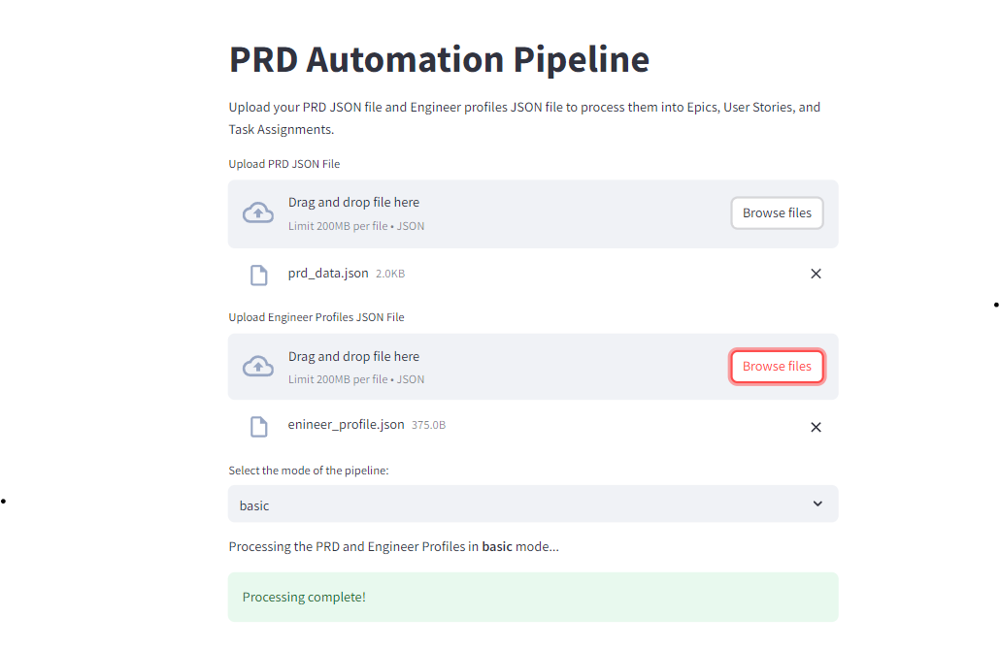
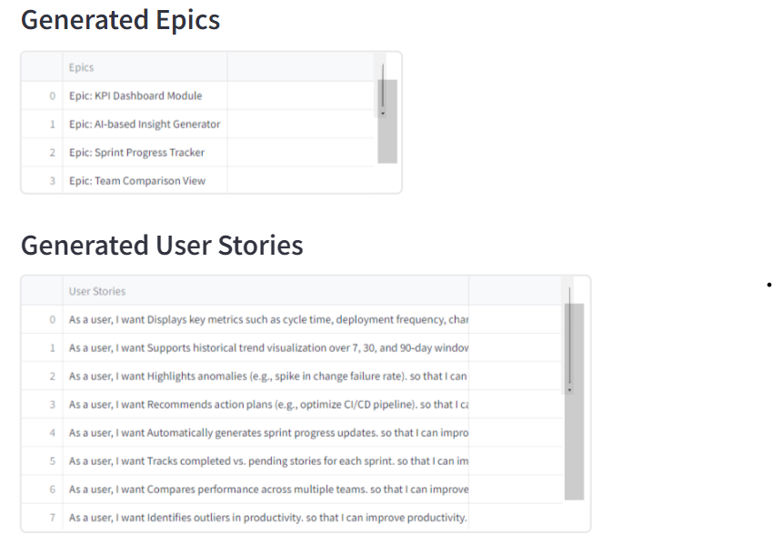
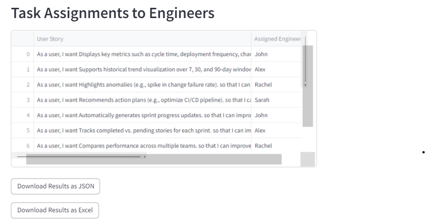

# PRD Automation Pipeline

A fully automated solution for analyzing and breaking down Product Requirement Documents (PRDs) using AI/ML and NLP, with intelligent task assignment and workload balancing. Includes streamlined deployment.

---

## 📖 **Table of Contents**

1. [Project Overview](#project-overview)
2. [Features](#features)
3. [Screenshots](#screenshots)
4. [Technologies](#technologies)
5. [Setup & Installation](#setup--installation)
6. [Running the Application](#running-the-application)

---

## 📝 **Project Overview**

The **PRD Automation Pipeline** automates the extraction of epics, user stories, and tasks from unstructured PRDs (Product Requirement Documents) using advanced NLP and machine learning techniques. The pipeline also assigns user stories to engineers based on their roles and skills, while balancing workload to optimize team performance.

The project is designed for **agile teams** looking to streamline product planning and backlog management through automated tools. The pipeline can be containerized using **Docker** and deployed through a **CI/CD pipeline** using GitHub Actions for continuous integration and delivery.

---

## ✨ **Features**

- **Automated PRD Processing**: Analyzes PRD documents and extracts key information such as objectives, user personas, and functional requirements.
- **Epic and User Story Generation**: Automatically breaks down functional requirements into epics and user stories.
- **Task Assignment**: Intelligent task assignment based on engineers' skills, roles, and workload.
- **Workload Balancing**: Uses advanced reinforcement learning algorithms to optimize workload distribution.
- **Modes**:
  - **Basic Mode**: Round-robin task assignment.
  - **Advanced Mode**: Skill-based task assignment.
  - **Optimized Mode**: Skill and workload balancing with reinforcement learning.
- **Streamlit Web Interface**: Upload PRD and engineer profiles, choose the processing mode, and view/download results.

---

## 🛠️ **Technologies**

- **Python 3.10**
- **Natural Language Processing (NLP)**: `transformers`, `sentence-transformers`
- **Machine Learning**: `Reinforcement Learning`
- **Streamlit**: Web-based interactive app

---

## ⚙️ **Setup & Installation**

### 1. Clone the Repository
```bash
git clone https://github.com/yourusername/prd-automation-pipeline.git
cd prd-automation-pipeline
```

### 2. Install Dependencies
Make sure you have Python 3.10 installed. Install the required dependencies using `pip`:
```bash
pip install -r requirements.txt
```

---

## 🚀 **Running the Application**

You can run the application in different modes:

### 1. **Basic Mode**
This mode uses simple round-robin task assignment.
```bash
python3 pipeline.py --mode basic --prd_file data/prd_data.json --engineers data/engineer_profile.json
```

### 2. **Advanced Mode**
This mode assigns tasks based on engineers' skills.
```bash
python3 pipeline.py --mode advanced --prd_file data/prd_data.json --engineers data/engineer_profile.json
```

### 3. **Optimized Mode**
This mode uses reinforcement learning for skill-based task assignment and workload balancing.
```bash
python3 pipeline.py --mode optimized --prd_file data/prd_data.json --engineers data/engineer_profile.json
```

---

## 💻 **Usage**

### Streamlit App
1. Upload your **PRD JSON** and **Engineer Profiles JSON**.
2. Select the mode (`basic`, `advanced`, or `optimized`).
3. View the generated epics, user stories, and task assignments.
4. Download results in **JSON** or **Excel** format.

### Example PRD JSON Input:
```json
{
    "product_name": "Hivel Insight Dashboard",
    "objectives": [
        "Provide real-time visibility into software engineering KPIs.",
        "Identify productivity bottlenecks."
    ],
    "functional_requirements": {
        "KPI Dashboard Module": [
            "Displays key metrics such as cycle time.",
            "Supports historical trend visualization."
        ]
    }
}
```

## 📷 **App Outputs**

### **1. Uploading Files and Selecting Mode**



### **2. Generated Epics and User Stories**



### **3. Task Assignment Results**



---
